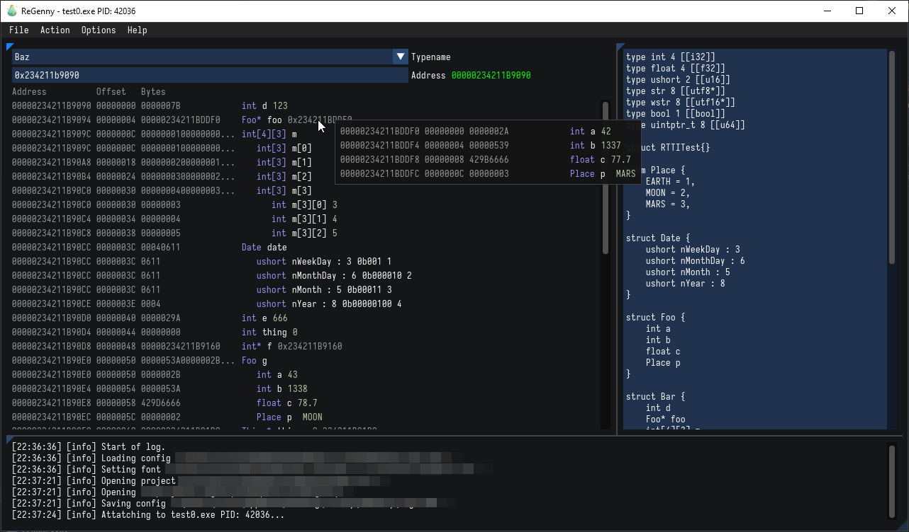

# ReGenny

[](https://github.com/cursey/regenny/actions/workflows/build.yml) 

[Usage & Scripting Documentation](https://praydog.github.io/regenny-book/)

ReGenny is a reverse engineering tool to interactively reconstruct structures and generate usable C++ header files. Header file generation is done by the sister project [SdkGenny](https://github.com/cursey/sdkgenny). 



## Status

ReGenny is still early in development but is usable. Things may change unexpectedly. Existing projects may break and need to be updated. Many more features are planned. There will be bugs.

## Download

ReGenny is under active development. Any published builds (or lack thereof) may be out of date. It is advised that if you want to use ReGenny in its current form that you build ReGenny yourself. However, you may be able to grab the latest artifact from GitHub actions [here](https://github.com/cursey/regenny/actions).

## Building

ReGenny uses [CMake](https://cmake.org/) via the help of [cmkr](https://github.com/build-cpp/cmkr).

From the command line:
```
cmake -B build
cmake --build build
```

## Design decisions

* ReGenny uses plaintext project files instead of binary ones (`.genny` and `.json`). Plaintext formats are much better for inclusion in git repositories and makes collaborating with others on ReGenny projects easier since you can diff/merge project files.
* Tree based display (like [ReClass.NET](https://github.com/ReClassNET/ReClass.NET)) but you build the tree using `.genny` files.
* ReGenny uses [SdkGenny](https://github.com/cursey/sdkgenny) for output. One of [SdkGenny](https://github.com/cursey/sdkgenny)'s primary goals is to generate good output and ReGenny reaps all the benefits from that. Instead of a single monolithic header file, ReGenny uses [SdkGenny](https://github.com/cursey/sdkgenny) to generate a proper header file hierarchy for inclusion into your project. If your project is already using [SdkGenny](https://github.com/cursey/sdkgenny) then you don't even need to generate header files since you can just use the `.genny` file directly.
* Since ReGenny uses [SdkGenny](https://github.com/cursey/sdkgenny), it supports everything `.genny` files do:
	* Namespaces
	* Enums
	* Structs
	* Classes
	* Function prototypes
	* Static function prototypes
	* Bitfields
	* Arrays
	* Multi-dimensional arrays
	* Pointers
	* Namespaces can be nested within each other
	* Structs, enums and classes can be nested within other structs/classes
	* Bring your own external types
* The `.genny` format is flexible enough to parse simple C/C++ structures directly with zero (or minimal) modification making importing existing structures into ReGenny easy.
